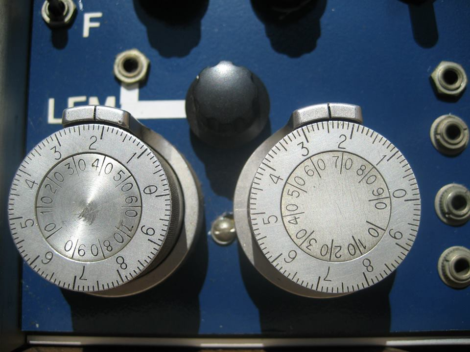

# thisthing
Alternate firmware for disting

## How to install and use ThisThing

You will need
* A PickIt3 hardware device
* The IPE software
* The disting firmware .hex file

Please read the instructions for installation carefully. They will tell you exactly what tools and software you need, and how to safely install ThisThing.

[Instructions for Installing the firmware](docs/flashing_disting.pdf)

## Information for coders

[Notes on the repository structure](docs/repository_structure.md)

